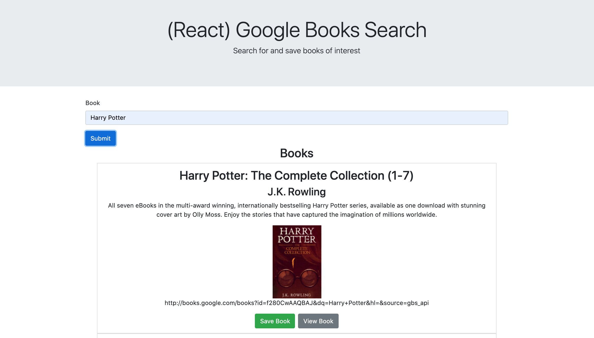

# google-book-search

## Description 

This project is a search engine for books through googles book api. This allows users to search titles or other keywords and find relevant books. The user can then save these books for later.

## Table of Contents

* [Usage](#usage)
* [License](#license)

## Usage 

This app requires no installation, simply view the app [here](https://arcane-gorge-07236.herokuapp.com/). To access the repository for this app, you can visit https://github.com/patrickhannan/google-book-search.

Use the navbar to update the page with what you want to see. The two pages are the search page and the save page. When you search for a book, you enter the keywords or title into the form and press submit. This will display relevant searches with images, titles, authors, descriptions, links, as well as the option to view or save this book. When you click save, the book will be saved to a database and then populated on the saved page. HOWEVER, as of right now this database is not properly saving books so this feature is limited,

When on the saved page, you would see the same information as the search page for the books you saved, with options to view or delete the book.

Below is a image of how the search page, for example, will look.

## License

MIT License

Copyright (c) 2020 Patrick Hannan

Permission is hereby granted, free of charge, to any person obtaining a copy of this software and associated documentation files (the "Software"), to deal in the Software without restriction, including without limitation the rights to use, copy, modify, merge, publish, distribute, sublicense, and/or sell copies of the Software, and to permit persons to whom the Software is furnished to do so, subject to the following conditions:

The above copyright notice and this permission notice shall be included in all copies or substantial portions of the Software.

THE SOFTWARE IS PROVIDED "AS IS", WITHOUT WARRANTY OF ANY KIND, EXPRESS OR IMPLIED, INCLUDING BUT NOT LIMITED TO THE WARRANTIES OF MERCHANTABILITY, FITNESS FOR A PARTICULAR PURPOSE AND NONINFRINGEMENT. IN NO EVENT SHALL THE AUTHORS OR COPYRIGHT HOLDERS BE LIABLE FOR ANY CLAIM, DAMAGES OR OTHER LIABILITY, WHETHER IN AN ACTION OF CONTRACT, TORT OR OTHERWISE, ARISING FROM, OUT OF OR IN CONNECTION WITH THE SOFTWARE OR THE USE OR OTHER DEALINGS IN THE SOFTWARE.